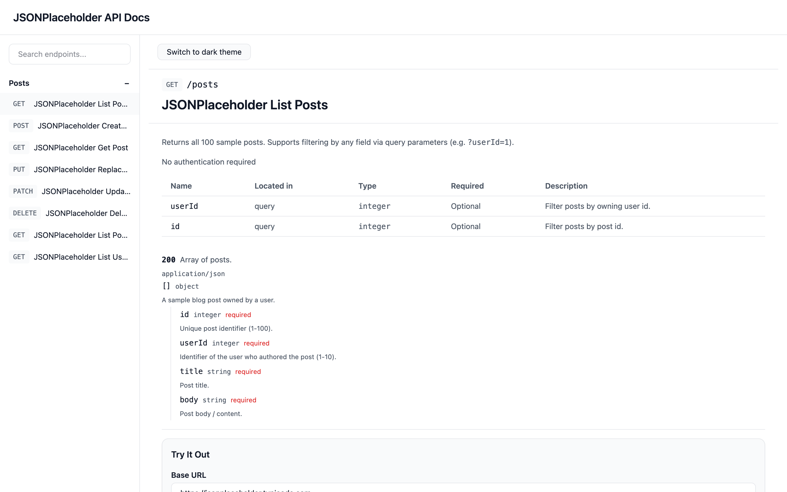
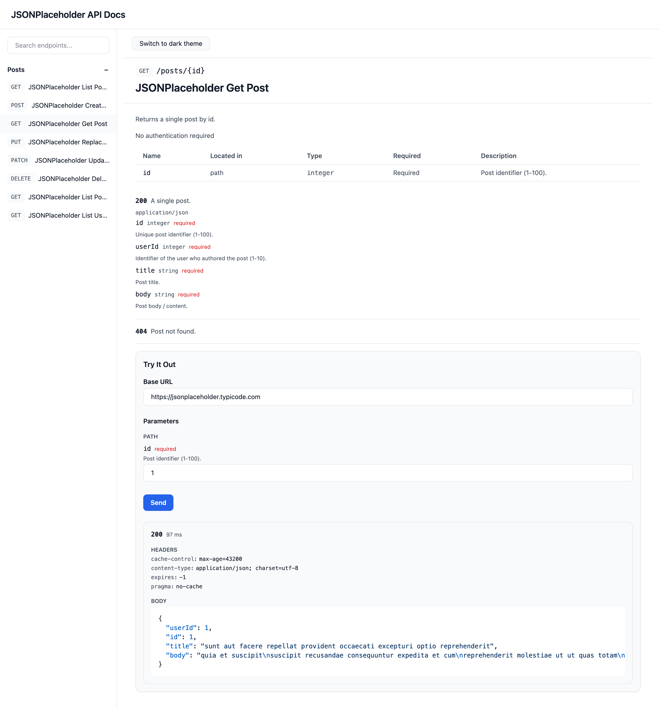
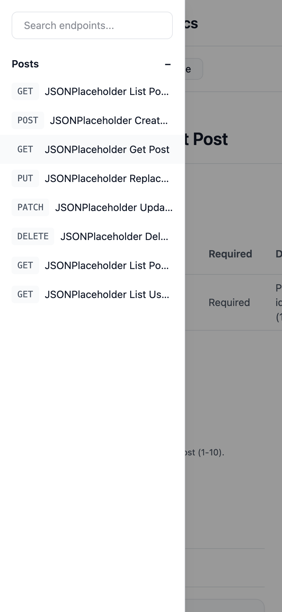
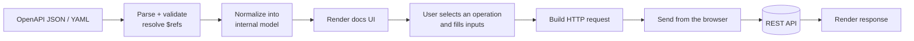
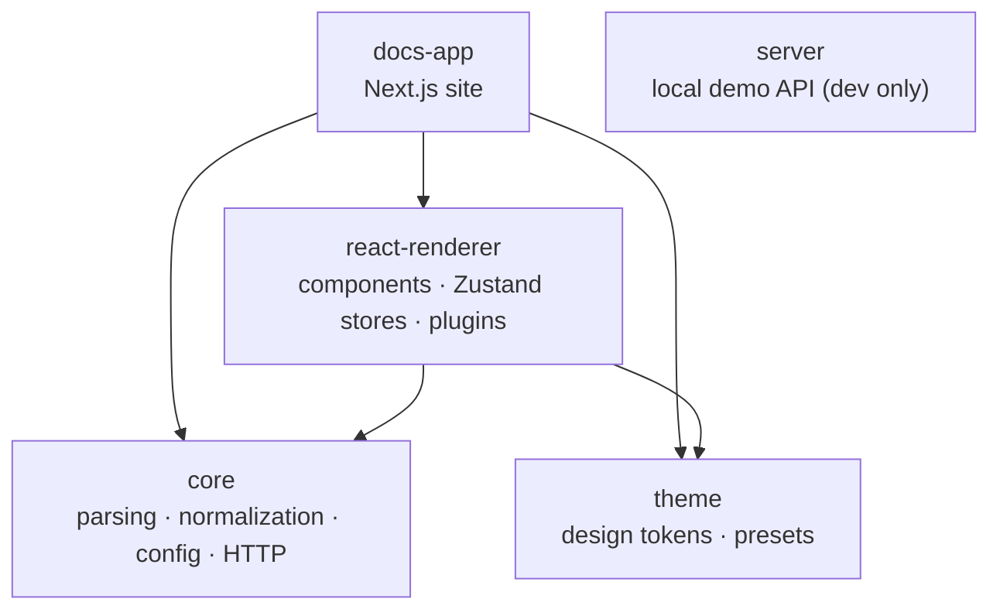

# OpenAPI Docs Platform

A customizable alternative to Swagger UI: point it at an OpenAPI document and it renders interactive REST API documentation, with a **Try It Out** panel that sends real HTTP requests from the browser and shows the live response.

**Live demo:** https://swagger-docs-app-shlok-696f.vercel.app/

The demo documents the public [JSONPlaceholder](https://jsonplaceholder.typicode.com) API, so Try It Out works for any visitor — pick an endpoint, fill in the inputs, press **Send**.

> This project is the documentation and interaction layer *for* REST APIs described by OpenAPI. It is not an API itself.



| Try It Out with a live response | Mobile navigation |
| --- | --- |
|  |  |

## Features

- **OpenAPI 3.0 and 3.1**, JSON or YAML, with validation and full `$ref` resolution (via `@apidevtools/swagger-parser`)
- **Normalized internal model** — the UI never touches raw OpenAPI; operations, parameters, request bodies, responses and security schemes are normalized once in `core`
- **Reference docs** — parameter tables, nested schema viewer (3.0 `nullable` and 3.1 type arrays), request body and response viewers with syntax highlighting
- **Try It Out** — editable base URL; path, query and header parameters; JSON request bodies; Bearer and API-key auth; status, timing, headers and body of the real response
- **Navigation** — virtualized sidebar grouped by tag, endpoint search with an empty-results state, deep links to every operation (`/docs/{tag}/{operationId}`)
- **Customization** — config-driven branding, layout and feature flags; light/dark theme built from design tokens; a plugin API for component overrides, auth strategies and request interceptors
- **Production UX** — responsive layout with a mobile drawer, loading and error states, spec-load timeout
- **Tested** — 550 unit/component tests (Vitest + Testing Library), strict TypeScript project references, and enforced package boundaries (dependency-cruiser)

## How it works



Parsing, normalization and request construction are pure TypeScript in `packages/core`; everything React lives in `packages/react-renderer`; the Next.js app only wires the two together.

## Architecture

A pnpm monorepo with five packages. Dependencies only point downward, and `pnpm run boundaries` fails the build if that ever changes.



| Package | Responsibility |
| --- | --- |
| [`packages/core`](packages/core) | Framework-free TypeScript: spec loading, validation, `$ref` resolution, normalization, config schema (Zod), HTTP request building and execution (Axios), plugin types |
| [`packages/theme`](packages/theme) | Design tokens (primitive → semantic → component), light/dark presets, CSS-variable and Tailwind generation |
| [`packages/react-renderer`](packages/react-renderer) | React components (shell, sidebar, schema/response viewers, Try It Out), Zustand stores, plugin registry |
| [`packages/docs-app`](packages/docs-app) | The deployed Next.js app: production config, spec loading, routing |
| [`packages/server`](packages/server) | Small Node HTTP API used during development to exercise Try It Out locally (not deployed) |

## Tech stack

TypeScript · React 19 · Next.js 16 (App Router) · Tailwind CSS 4 · Zustand · Zod · Axios · `@apidevtools/swagger-parser` · Shiki · TanStack Virtual · Vitest + Testing Library · dependency-cruiser · pnpm workspaces · Vercel

## Getting started

Requires **Node.js 20+** and **pnpm**. If `pnpm` isn't installed, `corepack pnpm` works in its place.

```bash
git clone https://github.com/shloksheladiya/Swagger.git
cd Swagger
pnpm install
pnpm dev          # builds the workspace packages, then starts Next.js on http://localhost:3000
```

### Commands

| Command | What it does |
| --- | --- |
| `pnpm dev` | Build packages and run the docs app in dev mode |
| `pnpm test` | Run all tests |
| `pnpm run build` | Type-check and build every package (`tsc -b`) |
| `pnpm run boundaries` | Build, then verify package dependency rules |
| `pnpm run app:build` | Full production build (packages, theme CSS, Next.js) |
| `pnpm run clean` | Remove build output and TypeScript build info |
| `pnpm demo-api` | Start the local demo API on `http://localhost:4000/v1` |

The workspace packages are consumed from their compiled `dist/` output. If a build ever reports that `@docs-platform/*` can't be resolved, run `pnpm run clean` and build again — stale `*.tsbuildinfo` files can make `tsc -b` skip emitting.

## Using your own OpenAPI document

The deployed app is driven by one file: [`packages/docs-app/app/production-config.ts`](packages/docs-app/app/production-config.ts).

```ts
export const productionConfig = {
  branding: { title: "JSONPlaceholder API Docs" },
  specSource: { type: "url", value: "/openapi.json" },
  layout: { sidebarPosition: "left" },
  features: { search: true, tryItOut: true },
};
```

To document a different API, either:

1. **Replace the bundled file** — overwrite `packages/docs-app/public/openapi.json` with your document (served same-origin, so no CORS setup), or
2. **Point at a hosted document** — set `specSource.value` to its URL, e.g. `https://api.example.com/openapi.json`. That host must allow cross-origin requests from the docs site.

Then update `branding.title` (it also sets the browser tab title) and optionally `branding.logoUrl`. `sidebarPosition` accepts `"left"` or `"right"`; `features.search` and `features.tryItOut` toggle those features. `specSource.type: "inline"` (a JSON/YAML string) is also supported.

## How Try It Out works

1. The **Base URL** field is pre-filled from the document's first `servers[].url` and can be edited.
2. Inputs are generated from the operation's parameters and its `application/json` request body schema; required fields are validated before sending.
3. `core` builds the request (path substitution, query string, headers, JSON body, auth credentials).
4. The request is sent **directly from the visitor's browser** with Axios — there is no proxy server.
5. The response is shown with its status, duration, headers and pretty-printed body. HTTP error statuses and network failures are displayed separately.

Because requests come from the browser, **the target API must allow CORS** from the docs site's origin. Public APIs such as JSONPlaceholder do; many private APIs will need their CORS settings updated.

## Deployment

The live site is deployed on Vercel with **Root Directory** set to `packages/docs-app`. Because the app imports the other workspace packages from their `dist/` builds, [`packages/docs-app/vercel.json`](packages/docs-app/vercel.json) overrides the build command to build the whole workspace first:

```json
{ "buildCommand": "cd ../.. && pnpm run app:build" }
```

Every other setting (install command, output directory) uses Vercel's Next.js defaults. The app itself has no server-side dependencies or environment variables, so any host that can run `next build` / `next start` will work the same way.

## Known limitations

- **CORS is required** for both a remote spec URL and every Try It Out target; there is no built-in proxy.
- **Auth:** Try It Out fills in HTTP Bearer and API-key (header or query) credentials. OAuth2 and OpenID Connect login flows, HTTP Basic, and cookie-based API keys (browsers can't set them from JavaScript) aren't built in — a plugin can register an auth strategy for other scheme types.
- **Request bodies:** only `application/json` bodies are editable; multipart and form-encoded bodies are not.
- **Server variables:** templated `servers[].url` values (e.g. `https://{region}.api.example.com`) are not substituted; edit the Base URL field instead.
- **Swagger 2.0** documents are not supported (only OpenAPI 3.x `servers` are read).
- **Spec sources:** `specSource.type: "file"` is not supported — the spec is loaded in the browser, so use a URL or inline content.
- **Config fields reserved for later:** `branding.faviconUrl` and `layout.mode: "single-page"` are accepted by the config schema but not yet used by the UI.

## Project layout

```
packages/
  core/             parsing, normalization, config, HTTP, plugin types (+ test-fixtures/)
  theme/            design tokens and presets
  react-renderer/   React components, stores, plugin registry
  docs-app/         Next.js app — production-config.ts, public/openapi.json
  server/           local demo API for development
docs/screenshots/   README images
```

`packages/docs-app/app` also contains example configs and specs (`example-*`, `stress-test-openapi-spec.ts`) used only by a development-mode config switcher for regression testing; they are excluded from production builds.

## License

[MIT](LICENSE) © 2026 Shlok Sheladiya
